1 开闭原则
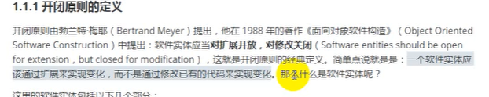

需求：催销打折

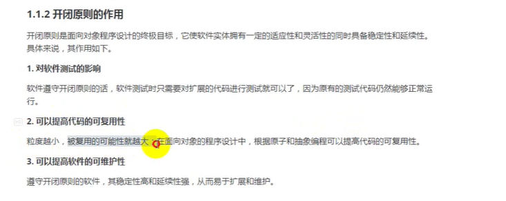

2 单一职责原则
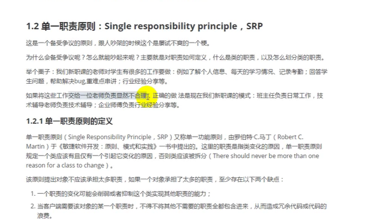
原则是死的，人是活的

里氏替换原则
——1.子类必须实现父类的方法
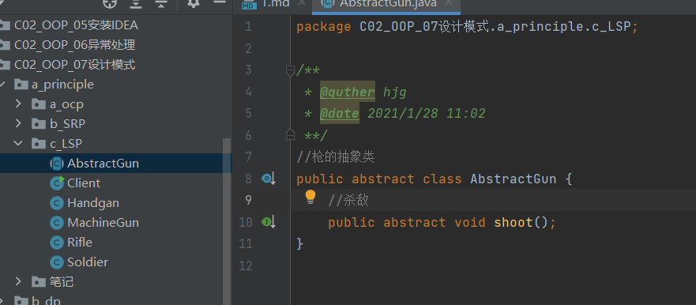
//给许三多配枪：参数可以是任何一把枪：机枪、步枪都可以

——2.子类特有方法
添加 AUG extends Rifle{
添加 
public class Snipper extends Soldier{
public void killEnemy(AUG aug) {

——3
向下转化不安全
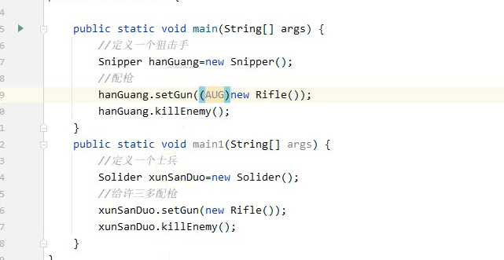

子类参数比父类宽松
添加 LSP
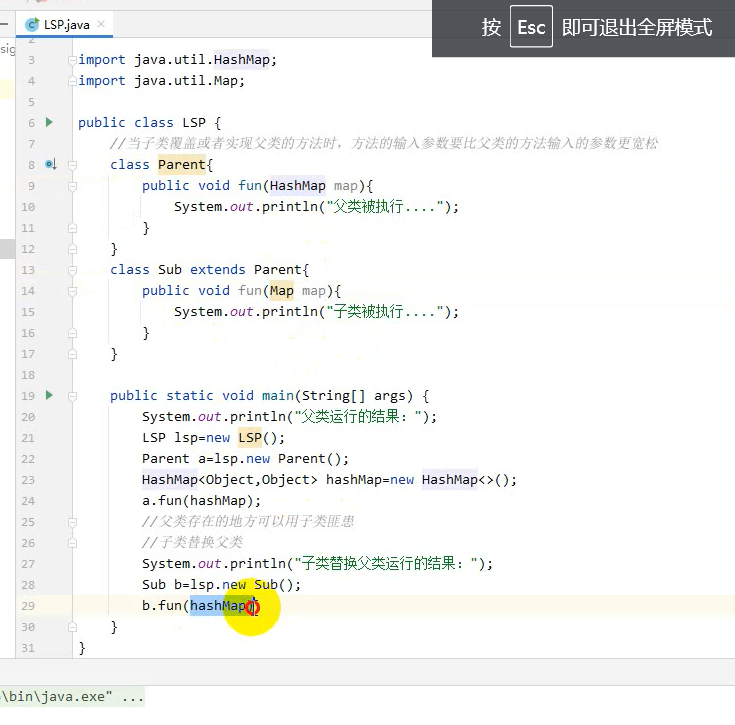

都是 父类被执行...  符合 里氏替换原则
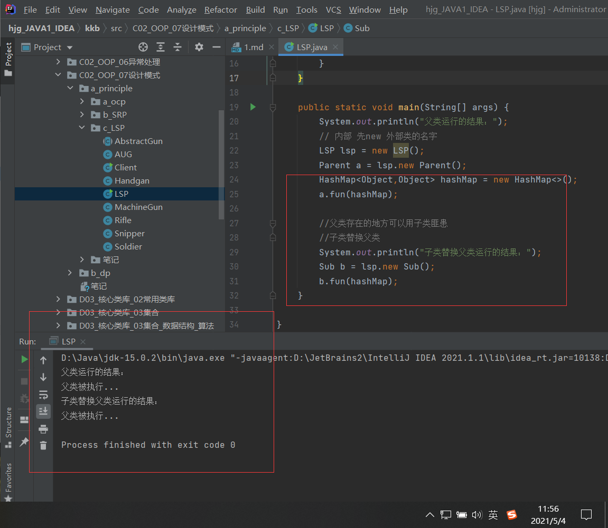
子类返回值比父类严格

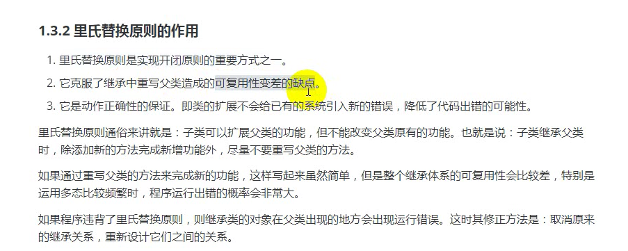

3.依赖倒置原则

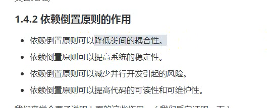

松耦合  不稳定性
并行开发

测试
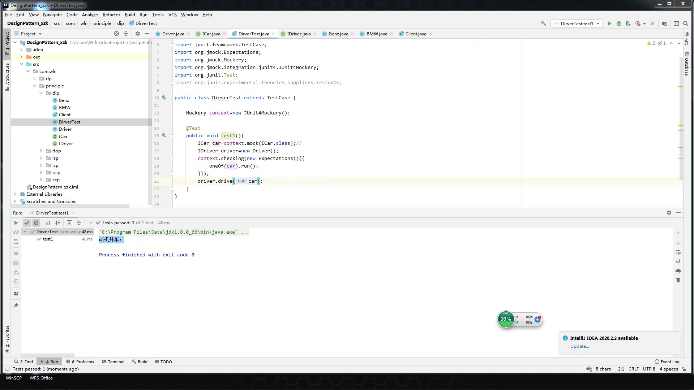

5.接口隔离原则 isp

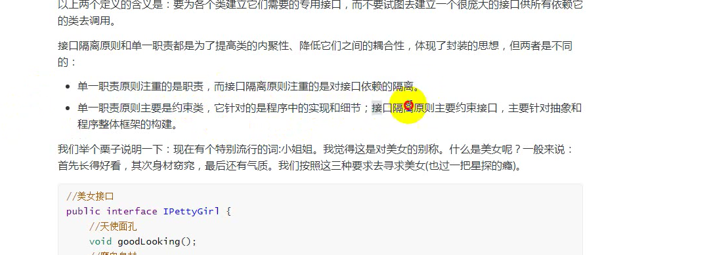

接口臃肿 拆分

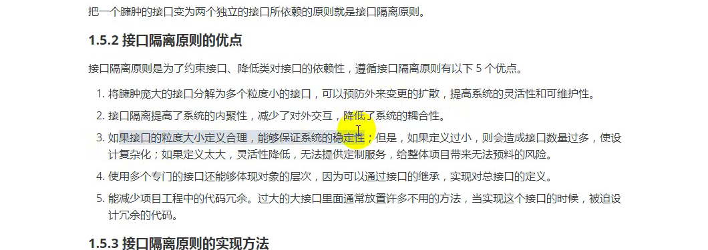

6.迪米特原则
它要求一个对象应该对其他对象有最少的了解。

