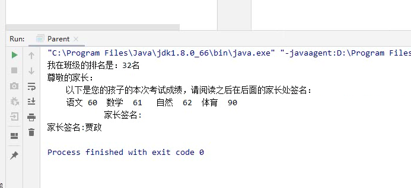

1 开闭原则

需求：催销打折

2 单一职责原则

原则是死的，人是活的

里氏替换原则
——1.子类必须实现父类的方法

//给许三多配枪：参数可以是任何一把枪：机枪、步枪都可以

——2.子类特有方法
添加 AUG extends Rifle{
添加 
public class Snipper extends Soldier{
public void killEnemy(AUG aug) {

——3
向下转化不安全

子类参数比父类宽松
添加 LSP

都是 父类被执行...  符合 里氏替换原则

子类返回值比父类严格

3.依赖倒置原则

松耦合  不稳定性
并行开发

测试

5.接口隔离原则 isp

接口臃肿 拆分

6.迪米特原则
它要求一个对象应该对其他对象有最少的了解。

