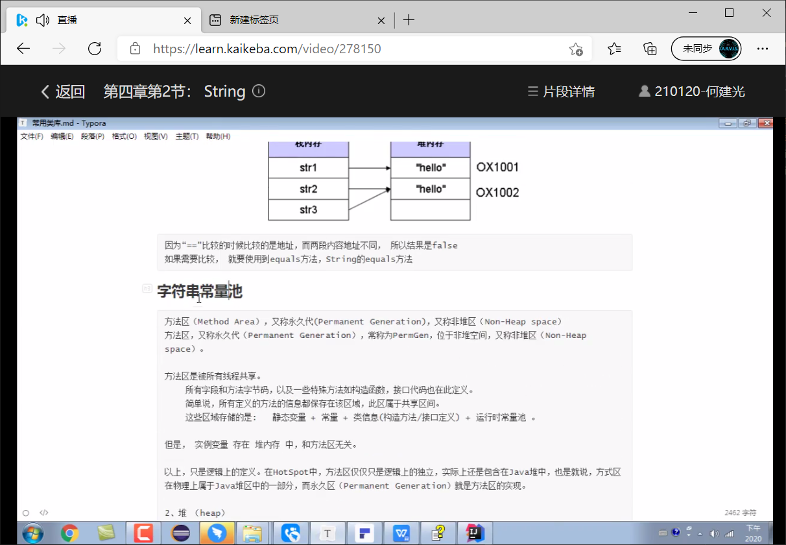
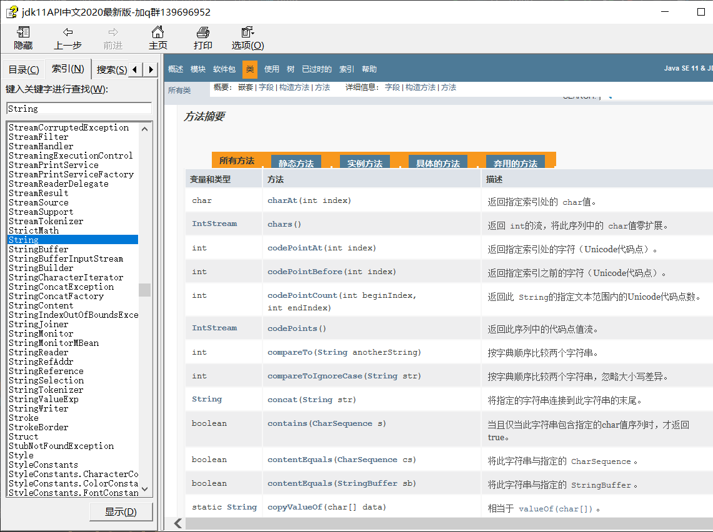
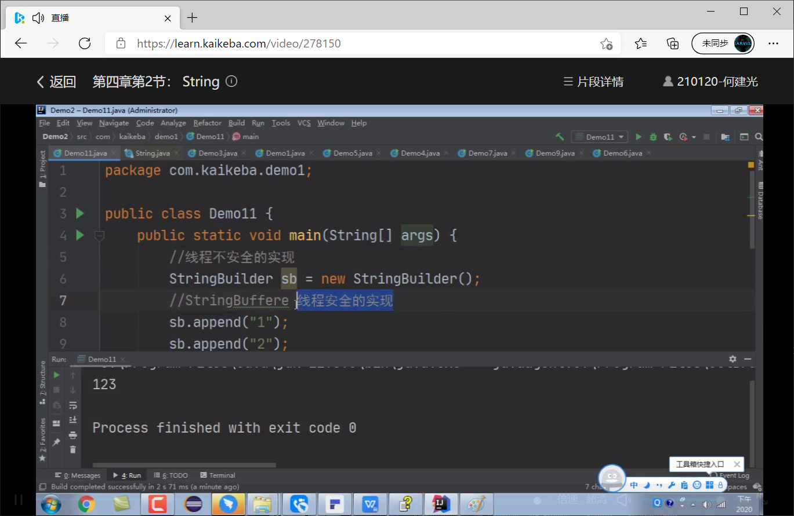

常用类库  --多练多用

# 1. 泛型
## 1.1概述
泛型，即“参数化类型”。就是将类型由原来的具体的类型参数化，类似于方法中的变量参数，此时类型也定 义成参数形式（可以称之为类型形参），然后在使用/调用时传入具体的类型（类型实参）。

## 1.2使用
### 1.2.1 泛型类

D1_Person
```java
//泛型类
public class D1_Person<A> {
private String name;
private int age;
private A data;

    public String getName() {
        return name;
    }
    public void setName(String name) {
        this.name = name;
    }
    public int getAge() {
        return age;
    }
    public void setAge(int age) {
        this.age = age;
    }
    public A getData() {
        return data;
    }
    public void setData(A data) {
        this.data = data;
    }
    @Override
    public String toString() {
        return "D1_Person{" +
                "name='" + name + '\'' +
                ", age=" + age +
                ", data=" + data +
                '}';
    }
}
```
D1_main
```java
public class D1_main {

    public static void main(String[] args) {
        D1_Person<String> p = new D1_Person<>();
        p.setData("123");
    }
}
```

### 1.2.2 泛型接口

### 1.2.3 泛型方法
`private static <T> T 方法名(T a, T b) {}` --特殊情况
不特殊的情况
```java
//泛型 提高代码复用
public class D1_main {
    public static void main(String[] args) {
        print("asd");
        print(123456); //Integer
    }

    //泛型方法
    public static <A> void print(A a){
        System.out.println(a);
    }
}
```
### 1.3 泛型限定和通配符


```java
//泛型 提高代码复用
public class D1_main {

    public static void main(String[] args) {
        //多态 左父右子
        Plate<Apple> p = new Plate<>();

        //上界限定
        Plate<? extends Fruit> T1 = new Plate<Apple>();
        //下界限定
        Plate<? super Apple> T2 = new Plate<Fruit>();
    }
}
    //泛型限定
    interface Fruit{}
    class Apple implements Fruit{}
    class Plate<T extends Fruit>{
        T data;
        
        //多个泛型类
//class Plate<T extends Fruit,E,W,S,A>{
//    T data;
//}
}
```

# 2. java.util.Objects

```java
import java.util.Objects;

public class D3_Person {
    private String name;

    @Override
    public boolean equals(Object o) {
        if (this == o) return true;
        if (o == null || getClass() != o.getClass()) return false;
        D3_Person d3_demo = (D3_Person) o;
        return Objects.equals(name, d3_demo.name);
    }

    @Override
    public int hashCode() {
        return Objects.hash(name);
    }
}
```
```java
import java.util.Objects;

public class D3_Demo2 {
    public static void main(String[] args) {
//        String s1 = null;
//        String s2 = "456";
//        System.out.println(s1.equals(s2));

        D3_Person p1 = null;
        D3_Person p2 = new D3_Person();
//        System.out.println(p1.equals(p2));
//        System.out.println(Objects.equals(p1,p2));
//        System.out.println(Objects.isNull(p1));
        System.out.println(Objects.requireNonNull(p1));

    }
}
```
# 3. java.lang.Math
学会用


# 4. java.util.Arrays
```java
import java.util.Arrays;

public class D5_Arrays {
    public static void main(String[] args) {
        int[] arr = {1,5,6,7,8,2,3,4,9};
        System.out.println(Arrays.toString(arr));
        Arrays.sort(arr);
        System.out.println(Arrays.toString(arr));

        System.out.println(Arrays.binarySearch(arr,2)); //下标

        System.out.println();
        System.out.println(arr.length);
        arr = Arrays.copyOf(arr,15); //动态扩容
        System.out.println(arr.length);
        System.out.println(Arrays.toString(arr));
    }
}
```
toString 源码

动态扩容


# 5. java.math.BigDecimal
银行金融


```java
import java.math.BigDecimal;

public class D6_BigDecimal {
    public static void main(String[] args) {
        BigDecimal b1 = new BigDecimal("0.1");
        BigDecimal b2 = new BigDecimal("0.2");
        BigDecimal b3 = b1.add(b2);  //接收 原来的没变


        System.out.println(b1);
        System.out.println(b2);
        System.out.println(b3);
        double v = b3.intValue();
        System.out.println(v);
    }
}
```

# 6. java.util.Date
国际化 时区


数据库


# 7. java.text.DateFormat
格式化日期


获取时间戳 计算时间差


# 8.java.util.Calendar

实现国际化
```java
import java.util.Calendar;
public class D9_Calendar {
    // set
    // get
    // add
    // getTime  :   获取日历时间 表示的Data对象
    //getActualMaxmun : 获取某字段的最大值
    public static void main(String[] args) {
        //Calendar
        Calendar c1 =  Calendar.getInstance();
//        c1.set(Calendar.YEAR,2021);
//        int year = c1.get(Calendar.YEAR);
//        int day = c1.get(Calendar.DAY_OF_YEAR);
//        int weak =  c1.get(Calendar.WEDNESDAY);
//        System.out.println();
//        System.out.println(year);
//        System.out.println(day);
//        System.out.println(weak);

//        c1.add(Calendar.MONTH,-1);
//        System.out.println(c1.get(Calendar.MONTH));
//        Date d = c1.getTime();
//        System.out.println(d);

        c1.set(Calendar.MONTH,2);
        int m = c1.getActualMaximum(Calendar.DAY_OF_MONTH);
        System.out.println(m);
    }
}
```

# 9. java.lang.System


# 10. String


String 每个版本会变



方法存在即合理



字符串不可改变  字符串拼接能避免就避免

垃圾在永久代里面不会被回收

字符串拼接避免不了就

toString

