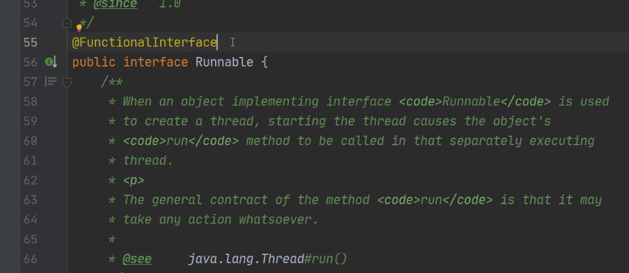
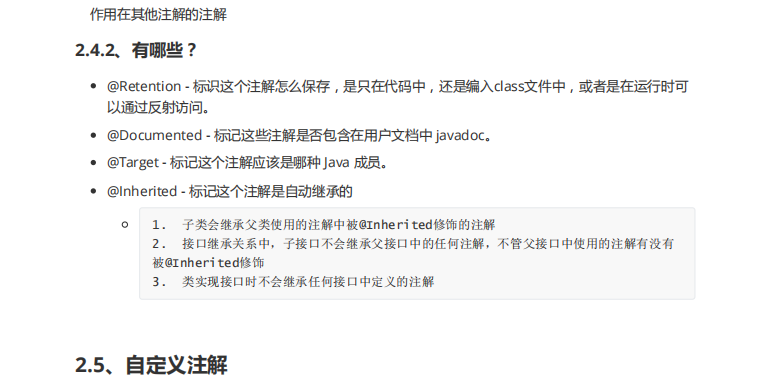
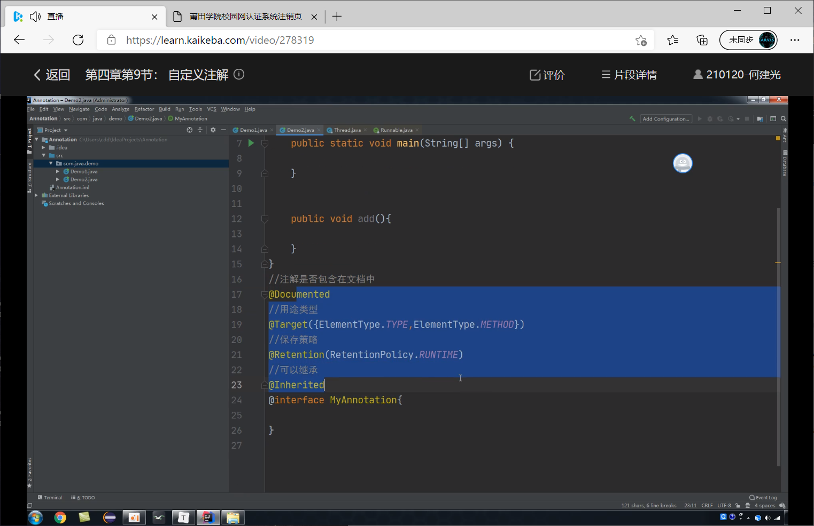

1.枚举

线程内部类 6个状态 enum
JDK 1.5 之前没有枚举

枚举常用方法
enum 抽象方法  

用枚举比较多的是用别人框架里面

枚举接口
Level3操作

枚举注意事项
    一旦定义了枚举，最好不要妄图修改里面的值，除非修改是必要的。
    枚举类默认继承的是java.lang.Enum类而不是Object类
    枚举类不能有子类，因为其枚举类默认被final修饰
    只能有private构造方法
    switch中使用枚举时，直接使用常量名，不用携带类名
    不能定义name属性，因为自带name属性
    不要为枚举类中的属性提供set方法，不符合枚举最初设计初衷。

注解概述  注释
Annotation
注解和反射
1. 概念
2. 怎么使用内置注解
3. 怎么自定义注解
4. 反射中怎么获取注解内容

内置注解   框架用的多
@Override ： 重写 *     {编译格式检查}
定义在java.lang.Override

@Deprecated：废弃 *
定义在java.lang.Deprecated

@SafeVarargs
Java 7 开始支持，忽略任何使用参数为泛型变量的方法或构造函数调用产生的警告。 

@FunctionalInterface： 函数式接口 *
Java 8 开始支持，标识一个匿名函数或函数式接口。

@Repeatable：标识某注解可以在同一个声明上使用多次

脑补代码
.....

自定义注解  元注解

看视频的时候BOzingga  自己博客 看文章的时候 可以加标记点  点击跳转

反射  java高级特性

类加载器与资源目录

