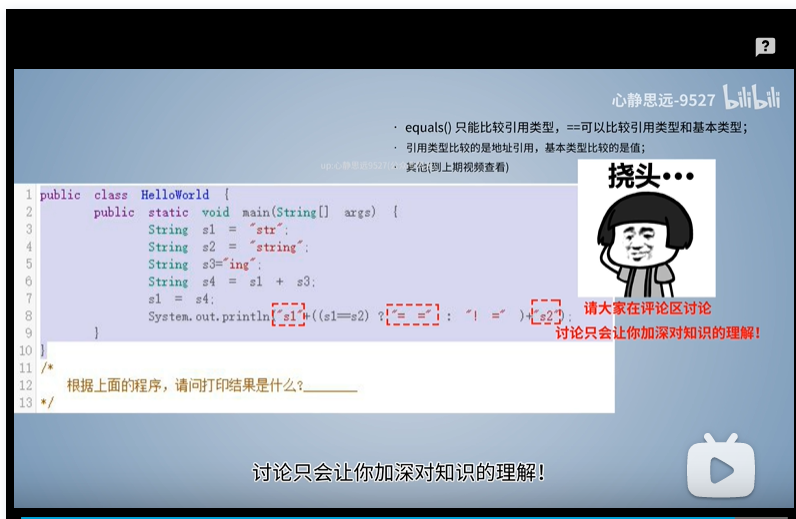
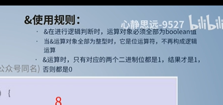

//命名规范

a006
// static 静态方法和非静态方法

a007
//编译出错  初始化问题

a008
//父类 private 不可用

a009
Java最基础算法题，请用代码设计一个求Xⁿ的方法？-06
可以去九张算法网站上搜二分法的讲解 和二次幂或快速幂的题解
就比如说你算2的10次方，暴力做法就是把2乘10次，如果用快速幂的做法，就是把2^10化解成(((2^2)^2)^2)*(2^2),我们只需要花费log(10)数量级的时间，就可以得到计算结果。

面试官: 你能跟我说说equals()和==有什么不同吗？-07

粉丝遇到的公司java笔试题！-08

a010

《Java基础题》逻辑运算 天天都在用！！-09
a010

Java底层常见运算符，读 底层源码 必备-10

请用代码写出将十进制转二进制的方法？不可调函数！-11 (动态评论区

a011

Java八进制、十进制、十六进制面试题，一次性搞定-13！！

Java符号(& | ^ ~ << >> >>>）   -15 

a012

一道70%面试都会遇到的题目，这几行代码创建了几个对象-18

