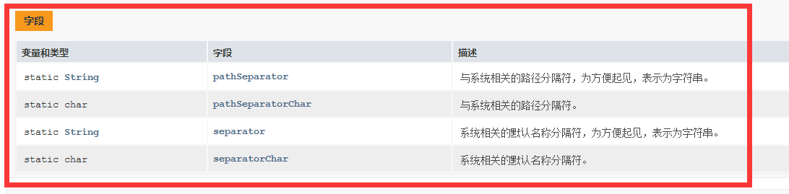
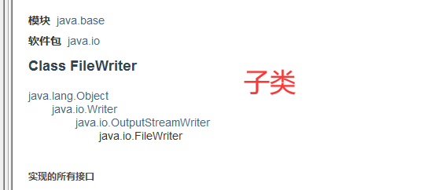

看完学到  

```java
01  Hello java.io
02  java.io.File
03  文件遍历案例
04  文件过滤器
05  相对与绝对路径
06  流概述
07  java.io.OutputStream
08  java.io.FileOutputStream
09  java.io.FileInputStream
11  字节流读取文字
12  字符输出
13  字符读取
14  flush刷新管道
15  字节转换字符流
16  Print与BufferedReader
17  收集异常日志
18  properties
19  序列化技术
20  try-with-resources
21  Serializable接口实现序列化和反序列化
22  部分属性的序列化和反序列化
23  Externalizable接口实现序列化和反序列化
```


# 01  Hello java.io


# 02  java.io.File
常用方法


还有 file.renameTo(newFile);

注意：路径分隔符  名称分隔符



# 03  文件遍历案例

想删除的话加上


# 04  文件过滤器

```java
import java.io.File;
import java.io.FileFilter;
import java.io.IOException;

//文件过滤器
public class Demo1 {
    public static void main(String[] args) throws IOException {
        File e = new File("e:\\");
        listFiles(e);
    }
    public static void listFiles(File file){
        //1.    创建一个过滤器 并描述规则
        FileFilter filter = new MDFilFilter();
        //2.    通过文件获取子文件夹
        File[] files = file.listFiles(filter);
        if (files!=null && files.length>0)
        for (File f:files) {
            if (f.isDirectory()){
                listFiles(f);
            }else {
                System.out.println("发现一个MD ："+f.getAbsolutePath());
            }
        }
    }

    static  class MDFilFilter implements FileFilter{

        @Override
        public boolean accept(File pathname) {
            if (pathname.getName().endsWith(".md") || pathname.isDirectory())
                return true;
            return false;
        }
    }
}
```
匿名内部类
```java

import java.io.File;
import java.io.FileFilter;
import java.io.IOException;

//文件过滤器 匿名内部类
public class Demo2 {
    public static void main(String[] args) throws IOException {
        File e = new File("e:\\");
        listFiles(e);
    }
    public static void listFiles(File file){
        //1.    创建一个过滤器 并描述规则
        /*FileFilter filter = new FileFilter(){
            @Override
            public boolean accept(File pathname) {
                if (pathname.getName().endsWith(".md") || pathname.isDirectory())
                    return true;
                return false;
            }
        };*/

        
        //2.    通过文件获取子文件夹
        File[] files = file.listFiles(new FileFilter(){  //好用的格式
            @Override
            public boolean accept(File pathname) {
                if (pathname.getName().endsWith(".md") || pathname.isDirectory())
                    return true;
                return false;
            }
        });
        if (files!=null && files.length>0)
        for (File f:files) {
            if (f.isDirectory()){
                listFiles(f);
            }else {
                System.out.println("发现一个MD ："+f.getAbsolutePath());
            }
        }
    }

    /*static  class MDFilFilter implements FileFilter{
        @Override
        public boolean accept(File pathname) {
            if (pathname.getName().endsWith(".md") || pathname.isDirectory())
                return true;
            return false;
        }
    }*/
}

```

# 05  相对与绝对路径
```java
import java.io.File;

public class Demo5 {
    public static void main(String[] args) {
        //相对路径：以盘符开始   例如c://a.txt
        //绝对路径:java中是相对于项目目录路径    例如  a.txt
        File file1 = new File("c://a.txt");
        File file2 = new File("a.txt");
        System.out.println("File1的路径"+file1.getAbsolutePath());
        System.out.println("File2的路径"+file2.getAbsolutePath());
    }
}
```

# 06  流概述
```java
    //IO流    可以把数据传输的操作看作是数据的流动，分为输入Input和输出Output
    //java的IO操作就是java.io包下的一些常用类的使用，通过这些常用类对数据进行读取和写出
    //硬件-》java运行内存-》目标地址

    //IO流的分类    通过流的方向可以分为：输入流和输出流
    //按照流动的数据类型分为：字节流  字符流
    //字节流：输入流   InputStream
    //       输出流   outputStream
    //字符流：输入流  Reader   字符流也是字节流
    //       输出流  Write
```
# 07  java.io.OutputStream


# 08  java.io.FileOutputStream


```java
    public static void main(String[] args) throws IOException {
        //OutputStream
        FileOutputStream fos = new FileOutputStream("f://a.txt");
//        FileOutputStream fos = new FileOutputStream("f://a.txt",true); //追加写

        /*byte[] bytes = {65,66,67,68,69};
        fos.write(bytes);*/
        //byte[] bytes2 = {65,66,67,68,69};
        
        byte[] bytes2 = "ABCDEF".getBytes();
        fos.write(bytes2,2,2); //2下标 写两个
        //fos.write(bytes2);
        fos.close();                //写在哪在哪关闭
        System.out.println("已经写出");

    }
```

# 09  java.io.FileInputStream
InputStream


FileInputStream 子类


```java
import java.io.FileInputStream;
import java.io.IOException;

public class Demo7 {
    //InputStream
    public static void main(String[] args) throws IOException {
        FileInputStream fis = new FileInputStream("c://a.txt");
        /*while (true){
            byte b = (byte) fis.read();
            if(b==-1){
                break;
            }
            System.out.println((chat)b);
        }*/
        byte[] bytes = new byte[10];
        int len = fis.read(bytes);  //注意误区
        System.out.println(new String(bytes,0,len));
        len = fis.read(bytes);
        System.out.println(new String(bytes,0,len));
        len = fis.read(bytes);
        System.out.println(new String(bytes,0,len));

        len = fis.read(bytes); //文件下载器  一次读一组
        System.out.println(len);
        fis.close();
    }
}
```

# 10  字符编码


# 11  字节流读取文字

锄禾日当午，汗滴禾下土。谁知盘中餐，粒粒皆辛苦。
字节长度不够会乱码 byte[] bytes = new byte[10];
byte[] bytes = new byte[10000];
```java
byte[] bytes = new byte[10];
int len = fis.read(bytes);  //注意误区
System.out.println(new String(bytes,0,len));
len = fis.read(bytes);
System.out.println(new String(bytes,0,len));
len = fis.read(bytes);
System.out.println(new String(bytes,0,len));

len = fis.read(bytes); //文件下载器  一次读一组
System.out.println(len);
fis.close();
```


# 12  字符输出




```java
import java.io.FileWriter;
import java.io.IOException;


public class Demo9 {
    public static void main(String[] args) throws IOException {
        //writer
        FileWriter fw = new FileWriter("f://b.txt",true); //追加不清空
        //fw.write('a');
        // append 方法返回 this （fw） 当前方法
        fw.append("锄禾日当午").append("，").append("汗滴禾下土");   //可以一致追加
        fw.write("锄禾日当午");
        fw.flush();        //刷新
        fw.close();

    }
}
```

# 13  字符读取


```java
import java.io.FileReader;
import java.io.IOException;


public class Demo10 {
    public static void main(String[] args) throws IOException {
        //reader
        FileReader fr = new FileReader("b.txt");
        while (true){
            int c = fr.read();
            if(c==-1){
                break;
            }
            System.out.print((char)c);
        }
        char[] chars = new char[100];
        //fr.read(chars);
        System.out.println(chars[0]); //0  组装
        
        int len = fr.read(chars);
        String text = new String(chars,0,len); //避免出现问题
        System.out.println(text);
        System.out.println(text.length());

        fr.close();
    }
}
```
# 14  flush刷新管道
字符输出流 刷新


# 15  字节转换字符流
使用了装饰者模式
```java
import java.io.*;

//使用了装饰者模式

public class Demo11 {
    public static void main(String[] args) throws IOException {
        //转换流  ：将字节流转换成字符流     使用了装饰者模式
        FileInputStream fis = new FileInputStream("c://a.txt");
        //将字节输入流转换为字符输入流  参数为要转换的字节流
        InputStreamReader isr = new InputStreamReader(fis,"gbk");
        while (true){
            int c = isr.read();
            if(c==-1){
                break;
            }
            System.out.println((char) c);
        }

        FileOutputStream fos = new FileOutputStream("c://a.txt");
        OutputStreamWriter osw = new OutputStreamWriter(fos); //文件上传 ...
        osw.write("床前明月光");
        osw.flush();
        osw.close();
    }
}
```
# 16  Print与BufferedReader
没有给代码，要自己敲
```java
import java.io.*;

/**
 * Print 与 BufferedReader
  */

public class Demo11_1 {
    public static void main(String[] args) throws IOException {
        //字符输出（打印流）Print
        /*PrintStream ps = new PrintStream("f://f.txt");
        ps.println("锄禾日当午");
        ps.println("汗滴禾下土");
        ps.println("谁知盘中餐");
        ps.println("粒粒皆辛苦");*/

        /*PrintWriter pw = new PrintWriter("f://f.txt");
        pw.println("锄禾日当午");
        pw.println("汗滴禾下土");
        pw.println("谁知盘中餐");
        pw.println("粒粒皆辛苦");
        pw.flush();*/

        /*FileOutputStream fos = new FileOutputStream("f://f.txt");
        PrintWriter pw = new PrintWriter(fos);
        pw.println("锄禾日当午");
        pw.println("汗滴禾下土");
        pw.println("谁知盘中餐");
        pw.println("粒粒皆辛苦");
        pw.flush();*/

        // 缓存读取流 ， 将字符输入流 转换为带有缓存 可以一次读取一行的缓存字符读取流
        FileReader fw = new FileReader("f://f.txt");
        BufferedReader br = new BufferedReader(fw);
        String text = br.readLine();
        System.out.println(text);

    }
}
```

# 17  收集异常日志
```java
import java.io.FileNotFoundException;
import java.io.PrintWriter;
import java.text.SimpleDateFormat;
import java.util.Date;


public class Demo12 {
    public static void main(String[] args) throws FileNotFoundException {
        //收集异常信息
        try {
            String s = null;
            s.toString();
        }catch (Exception e){  // 收集异常信息 框架&& 库
            PrintWriter pw = new PrintWriter("f://bug.txt");
            SimpleDateFormat format = new SimpleDateFormat("yyyy-MM-dd HH:mm");
            pw.print(format.format(new Date()));
            e.printStackTrace(pw);
            pw.close();
        }
    }
}
```

# 18  properties
IO和集合 【map集合】

```java
import java.io.FileReader;
import java.io.IOException;
import java.io.Reader;
import java.util.Properties;

//Properties IO和集合 【map集合】
public class Demo13 {
    public static void main(String[] args) throws IOException {
        //properties文件与properties类
        /*Properties pt = new Properties();
        //键=值 load save
        pt.put("name","金苹果");
        pt.put("info","讲述历了金苹果种植的过程");
        FileWriter fw = new FileWriter("c://book.properties");
        pt.store(fw,"存储的图书");
        fw.close();*/  //uncode 编码转化

        Properties pt = new Properties(); //大量使用 .Properties 文件做配置文件
        Reader fw = new FileReader("c：//book.properties");
        pt.load(fw);
        System.out.println("name");
        System.out.println("info");
    }
}
```

# 19  序列化技术
没有 implements Serializable 保错
 
```java
import java.io.*;

public class Demo14 {
    public static void main(String[] args) throws IOException, ClassNotFoundException {
        //序列化与反序列化   java官方想放弃 阿里有用
        Book b = new Book("金苹果","讲述了种植过程");
        ObjectOutputStream oos = new ObjectOutputStream(new FileOutputStream("f://book.hahas"));
        oos.writeObject(b);
        oos.close();

        ObjectInputStream ois = new ObjectInputStream(new FileInputStream("f://book.hahas"));
        Book o = (Book)  ois.readObject(); //添加了 ClassNotFoundException
        System.out.println(o.getInfo());


    }
    class person implements Serializable{
        private String name;
        private int age;
    }

    static class Book  implements Serializable{ //标记接口 implements Serializable
        private String name;
        private String info;
        private person p; //包含类也要 implements Serializable 不然会报错 ，常用的集合类型自己有 implements Serializable

        public Book(String name, String info) {
            this.name = name;
            this.info = info;
        }

        public Book() {
        }

        public String getName() {
            return name;
        }

        public void setName(String name) {
            this.name = name;
        }

        public String getInfo() {
            return info;
        }

        public void setInfo(String info) {
            this.info = info;
        }

        @Override
        public String toString() {
            return "Book{" +
                    "name='" + name + '\'' +
                    ", info='" + info + '\'' +
                    '}';
        }
    }
}
```

# 20  try-with-resources
```java
import java.io.Closeable;
import java.io.FileNotFoundException;
import java.io.IOException;

public class Demo15 {
    public static void main(String[] args) throws FileNotFoundException {
        //try-with-resources
        //1.7 之前
        /*try {
            FileReader fr = new FileReader("c：//book.txt");
            int c = fr.read();
            System.out.println((char)c);
            fr.close();
        } catch (IOException e) {
            e.printStackTrace();
        }*/

        //jdk9 进行优化  自动关闭
        /*FileReader fr = new FileReader("c：//book.txt");
        PrintWriter pw = new PrintWriter("c：//book.txt");
        try(fr;pw){
            int c = fr.read();
            System.out.println((char)c);
        }catch (IOException e) {
            e.printStackTrace();
        }*/

        CloseDemo d = new CloseDemo();
        try(d){
            
        }catch (Exception e){

        }

    }
    static class CloseDemo implements Closeable{

        @Override
        public void close() throws IOException {
            System.out.println("close 方法被调用。。");
        }
    }

}
```

# 21  java 中的 Serializable 接口实现 序列化 和 反序列化
Java序列化是指把Java对象转换为字节序列的过程，Java反序列化是指把字节序列恢复为Java对象的过程。通过徐序列化和反序列化实现网络传输、本地存储的目的。
## 1.1 Serializable实现Java序列化
要实现Java对象的序列化，只要将类实现标识接口——Serializable接口即可，不需要我们重写任何方法就可以实现序列化
代码结构

### 1.1.1 编写实体类
```java
import java.io.Serializable;
import java.util.List;
/*** 学生实体类 */
public class Student implements Serializable {
    private String stuNum; //学号
    public  String stuName; //姓名
    private List<String> teacherlist; //教师姓名：一个学生可以有多个老师

    public Student() { //无参数构造方法
    }
    //全参构造方法
    public Student(String stuNum, String stuName, List<String> teacherlist) {
        this.stuNum = stuNum;
        this.stuName = stuName;
        this.teacherlist = teacherlist;
    }
    @Override
    public String toString() {
        return "Student{" +
                "stuNum='" + stuNum + '\'' +
                ", stuName='" + stuName + '\'' +
                ", teacherlist=" + teacherlist +
                '}';
    }

    public String getStuNum() {
        return stuNum;
    }

    public void setStuNum(String stuNum) {
        this.stuNum = stuNum;
    }

    public String getStuName() {
        return stuName;
    }

    public void setStuName(String stuName) {
        this.stuName = stuName;
    }

    public List<String> getTeacherlist() {
        return teacherlist;
    }

    public void setTeacherlist(List<String> teacherlist) {
        this.teacherlist = teacherlist;
    }
}
```
### 1.1.2 编写Java对象序列化和反序列化工具类
```java
import java.io.*;

/*** 序列化和反序列化的工具类 */
public class MySerializeUtil {
    /**
     * 将对象序列化到指定文件中
     * @param obj
     * @param fileName
     * @throws IOException
     */
    public static void mySerialize(Object obj , String fileName) throws IOException {
        OutputStream out = new FileOutputStream(fileName);
        ObjectOutputStream objOut=new ObjectOutputStream(out);
        objOut.writeObject(obj);
        objOut.close();
    }

    /**
     * 从指定文件中反序列化对象
     * @param fileName
     * @return
     * @throws IOException
     * @throws ClassNotFoundException
     */
    public static Object myDeserialize(String fileName) throws IOException, ClassNotFoundException {
        InputStream in=new FileInputStream(fileName);
        ObjectInputStream objIn=new ObjectInputStream(in);
        Object obj=objIn.readObject();
        return obj;
    }

}
```
### 1.1.3 测试对象的序列化和反序列化
```java
import java.util.ArrayList;
import java.util.List;

public class MainTest {
    public static void main(String[] args) {
        List<String> teacherList=new ArrayList<>();
        teacherList.add("空空道人");
        teacherList.add("贾代儒");
        Student stu1=new Student("1001", "贾宝玉", teacherList);
        System.out.println("原始对象："+stu1);

        String fileName="stu01.txt";
        try{
            //对象 序列化
            MySerializeUtil.mySerialize(stu1,fileName);
            System.out.println("序列化原始对象完成！OK！");
            //对象 反序列化
            Object obj=MySerializeUtil.myDeserialize(fileName);
            if(obj instanceof Student){
                Student stuNew= (Student) obj;
                System.out.println("反序列化之后的对象："+stuNew);
            }
        }catch (Exception e) {
            e.printStackTrace();
        }
    }
}
```

# 22  部分属性的序列化和反序列化
实现部分字段序列化的方式：
- 使用transient修饰符
- 使用static修饰符
- 默认方法writeObject和readObject。
- 卖个关子，稍后讲解。
### 1.2.1 使用transient修饰符
### 1.2.2 使用static修饰符
直接在属性里面做手脚


做 static 修饰属性的时候，在 MainTest里面加上 "hjg"


### 1.2.3 默认方法writeObject和readObject
修改实体类，将transient修饰词去掉，添加两个方法。

```java
/*** 学生实体类 */
public class Student implements Serializable {
    private String stuNum; //学号
    public  String stuName; //姓名
    private List<String> teacherlist; //教师姓名：一个学生可以有多个老师

    private void writeObject(ObjectOutputStream objOut) throws IOException {
        System.out.println("writeObject-----------");
        objOut.writeObject(stuNum);
        objOut.writeObject(stuName);
    }

    private void readObject(ObjectInputStream objIn) throws IOException, ClassNotFoundException {
        System.out.println("readObject-----------");
        stuNum= (String) objIn.readObject();
        stuName= (String) objIn.readObject();
    }

```
重新运行测试类的结果：
我们在添加的方法中只对stuNum和stuName属性做了序列化和反序列化的操作，因此只有这个两个属
性可以被序列化和反序列化。


#### 1.2.3.1 源码分析：
>注意：添加的两个方法必须是private void，否则不生效。
Java调用ObjectOutputStream类检查其是否有私有的、无返回值的writeObject方法，如果有，
其会委托该方法进行对象序列化。
> 


通过上面这两段代码可以知道，如果writeObjectMethod != null（目标类中定义了私有的writeObject
方法），那么将调用目标类中的writeObject方法，如果如果writeObjectMethod == null，那么将调用
默认的defaultWriteFields方法来读取目标类中的属性。
readObject的调用逻辑和writeObject一样。
总结一下，如果目标类中没有定义私有的writeObject或readObject方法，那么序列化和反序列化的时
候将调用默认的方法来根据目标类中的属性来进行序列化和反序列化，而如果目标类中定义了私有的
writeObject或readObject方法，那么序列化和反序列化的时候将调用目标类指定的writeObject或 readObject方法来实现。

# 23  Externalizable 接口实现 序列化 和 反序列化
刚刚我们说实现部分属性序列化的方式有多种，最后一种来啦！就是通过实现Eexternalizable接口。
Externalizable继承自Serializable，使用Externalizable接口需要实现readExternal方法和
writeExternal方法来实现序列化和反序列化。
来看看Externalizable接口的说明：


代码 ：
```java
import java.io.*;
import java.util.List;

/*** 学生实体类 */
public class Student implements Externalizable {
    private String stuNum; //学号
    public  String stuName; //姓名
    private List<String> teacherlist; //教师姓名：一个学生可以有多个老师

    public Student() { //无参数构造方法
    }
    //全参构造方法
    public Student(String stuNum, String stuName, List<String> teacherlist) {
        this.stuNum = stuNum;
        this.stuName = stuName;
        this.teacherlist = teacherlist;
    }
    @Override
    public String toString() {
        return "Student{" +
                "stuNum='" + stuNum + '\'' +
                ", stuName='" + stuName + '\'' +
                ", teacherlist=" + teacherlist +
                '}';
    }

    public String getStuNum() {
        return stuNum;
    }

    public void setStuNum(String stuNum) {
        this.stuNum = stuNum;
    }

    public String getStuName() {
        return stuName;
    }

    public void setStuName(String stuName) {
        this.stuName = stuName;
    }

    public List<String> getTeacherlist() {
        return teacherlist;
    }

    public void setTeacherlist(List<String> teacherlist) {
        this.teacherlist = teacherlist;
    }

    @Override
    public void writeExternal(ObjectOutput out) throws IOException {
        out.writeObject(stuNum);
        out.writeObject(stuName);
        //out.writeObject(teacherList);
    }

    @Override
    public void readExternal(ObjectInput in) throws IOException, ClassNotFoundException {
        stuNum= (String) in.readObject();
        stuName= (String) in.readObject();
        //teacherList= (List<String>) in.readObject();
    }
}
```


Externalizable接口继承了Serializable接口，所以实现Externalizable接口也能实现序列化和反序列
化。
Externalizable接口中定义了writeExternal和readExternal两个抽象方法，这两个方法其实对应
Serializable接口的writeObject和readObject方法。可以这样理解：Externalizable接口被设计出来的
目的就是为了抽象出writeObject和readObject这两个方法，但是目前这个接口使用的并不多。

