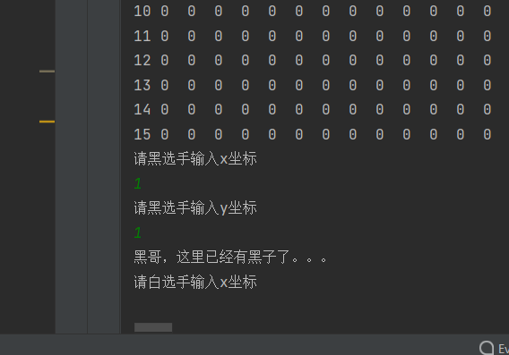

```java

checkerboard    棋盘类{
    显示棋盘
    X轴 y轴 对边框进行轴叙述
    对初始棋盘进行归零处理
    棋局开始后接收棋手的落子
    归环境类管，受裁判监控
    显示棋子
}

chess_player  棋手类{
    下棋
    选择非零幸运数字（1,2,3,4,5,6，7，8,9）
    悔棋
    认输
    记住自己下的每一步
}

referee   裁判类{
    判断先手，确定黑白
    限时指定谁下，超时犯规，对方赢
    怎么算犯规
    下棋的地方有棋子
    下棋的地方越界
    判断谁赢
    提供棋手可选择幸运数字（1,2,3,4,5,6，7，8,9）
    记录回合数（最多（15*15）/2=112个回合）
}

Main 环境类{
    一个棋盘
    一个裁判
    两个棋手
}


可以考虑加一个倒计时 https://www.jb51.net/article/191811.htm
没有机器人
没有智能棋盘（棋盘+裁判）
```

有bug  在一个坐标已经有棋子的时候，后手的人故意下那个坐标会导致回合重新开始


