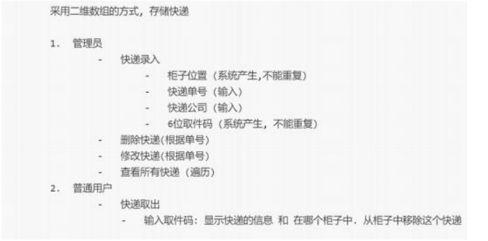
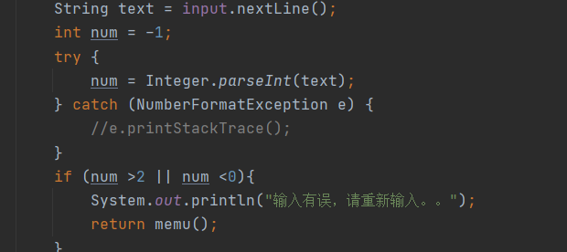
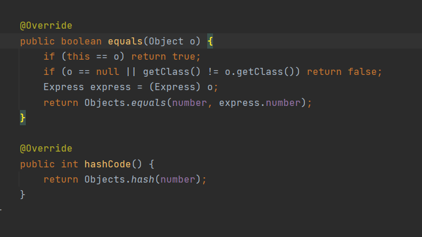
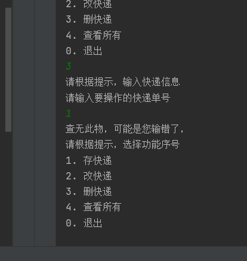
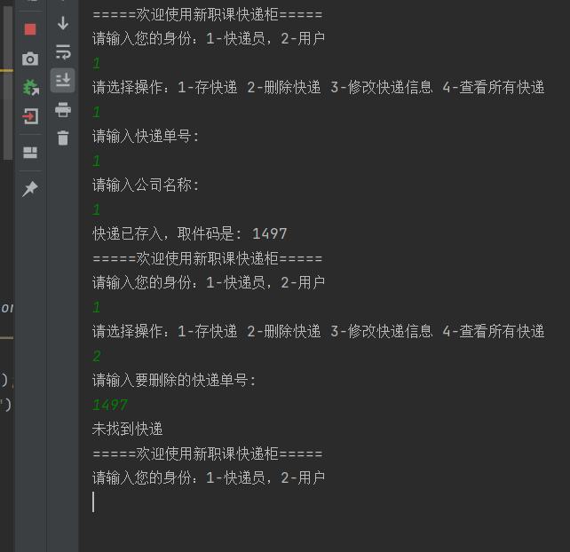
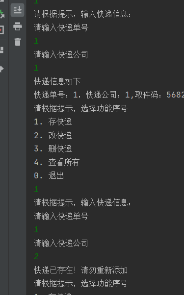

0-1-2

1.  快递管理系统

模块分析：MVC 思维跳跃 低耦合
    1.  V视图展示（欢迎，菜单，子菜单。。。）
    2.  D(M) dao server 数据存取（快递数据）  //数组 集合 链表  二叉树
    3.  C调度逻辑（根据视图接收到的用户输入内容，调度数据存取）   

1 2 工具
3 逻辑
java 大项目 : ATM 快递e栈 考试系统

bean  没有任何业务逻辑 所有属性全部私有 提供get。set方法  提供无参构造器

控制台简易版

****

***

******

****
您输入的是 取件码不是快递单号

*****
快递单号重复

